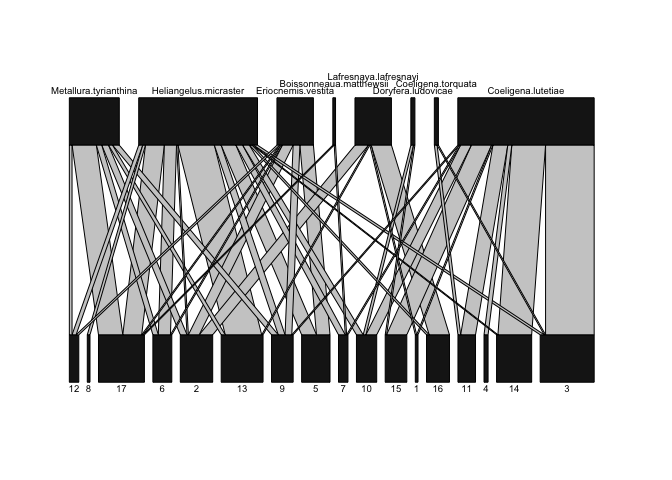
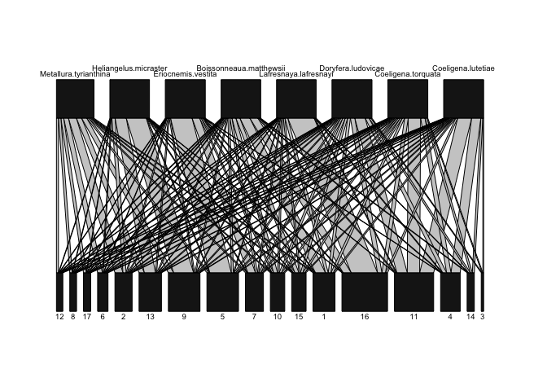
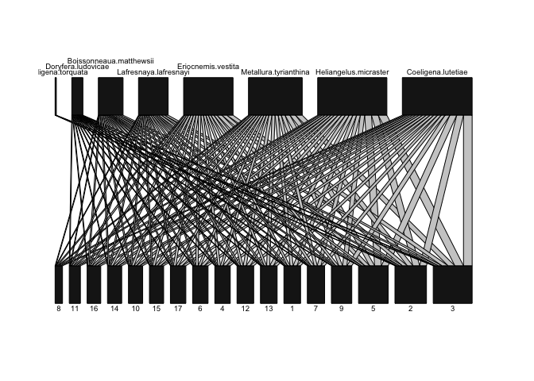
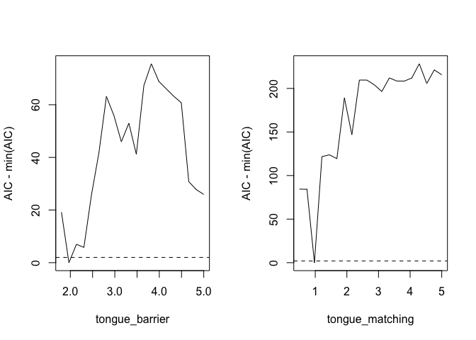
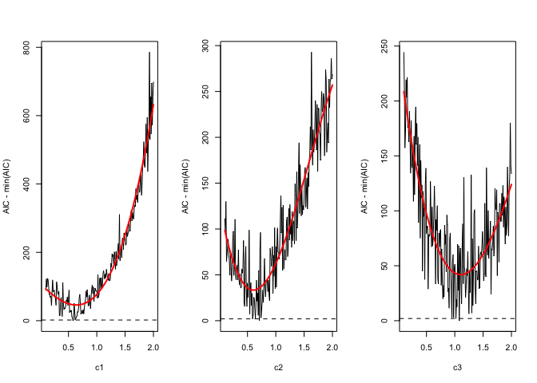

HumPlant R package
================
2025-02-14

- [Visualising community structure aming interacting hummingbirds and
  plants](#visualising-community-structure-aming-interacting-hummingbirds-and-plants)
  - [Installing the package](#installing-the-package)
  - [Taking a look at the data](#taking-a-look-at-the-data)
  - [Defining models for how morphologies influence the species’
    interactions](#defining-models-for-how-morphologies-influence-the-species-interactions)
  - [Simulate an interaction network based on the two morphological
    models](#simulate-an-interaction-network-based-on-the-two-morphological-models)
  - [Simulate an interaction network based on the species’
    abundances.](#simulate-an-interaction-network-based-on-the-species-abundances)
  - [Combining models based on abundances and
    morphologies](#combining-models-based-on-abundances-and-morphologies)
- [Statistical analyses](#statistical-analyses)
  - [Model fitting with single predictor
    versions](#model-fitting-with-single-predictor-versions)
  - [Model selection with varying predictor
    versions](#model-selection-with-varying-predictor-versions)
- [References](#references)

## Visualising community structure aming interacting hummingbirds and plants

The following script will guide you through examples of how to model
mechanisms, such as morphological matching, and visualise their effects
on species interactions.

### Installing the package

You will use the functions from the ‘HumPlant’ R package, which is
hosted on this GitHub page. We use another package called ‘devtools’ to
install it, which we first have to install and load in your R session.
Remove the hashtag to enable the installation.

``` r
#install.packages('devtools') #you only need to run this once
require(devtools)
```

I will refine the content throughout the course with your feedback and
suggestions. Therefore, you must reinstall the package using the code
below after each update. Remove the hashtag to enable the installation.

``` r
#devtools::install_github("JesSonne/HumPlant")
```

Now load the package in your current R session.

``` r
library(HumPlant)
```

### Taking a look at the data

The object ‘Cajanuma’ contains the data I collected at the
high-elevation site in Southern Ecuador. It contains the interaction
network along with the ecological attributes we will use for the
modelling.

Below, we define a series of objects with the data we are going to use.
Notice that the birds and plants are sorted according to the length of
their bill/flower

``` r
#loading the interaction matrix
net=Cajanuma$Network;net=as.matrix(net)

#loading ecological attributes
hum_morph=Cajanuma$Hummingbird_morphologies
plant_morph=Cajanuma$Plant_morphologies

hum_curvature=Cajanuma$Hummingbird_curvature
plant_curvature=Cajanuma$Plant_curvature

hum_abund=Cajanuma$Hummingbird_abundances
plant_abund=Cajanuma$Plant_abundances

plant_phenol=Cajanuma$Plant_phenologies

#number of hummingbirds and plants in the comunity
n_hums=ncol(net)
n_plants=nrow(net)
```

Use the ‘plotweb’ function to visualise the network. Notice that the
species are sorted according to the length of their bill/flowers from
the shortest bills/flowers on the left to the longest on the right.

``` r
plotweb(net,method="normal",empty = F)
```

<!-- -->

The following code converts or ‘tile’ the vectors on the ecological
attributes into a matrix format. This is just to make them easier to
work with.

``` r
hum_morph_mat=tile_vector(net,hum_morph)
plant_morph_mat=tile_vector(net,plant_morph,by_col = T)

hum_abund_mat=tile_vector(net,hum_abund)
plant_abund_mat=tile_vector(net,plant_abund,by_col = T)

hum_abund_mat=tile_vector(var=hum_abund)
plant_abund_mat=tile_vector(var=plant_abund,by_col = T)
```

### Defining models for how morphologies influence the species’ interactions

The code below defines two initial models for how the morphologies of
species might influence the species’ interactions. These are just two
examples to get you started. In the project, you should come up with
additional models that perhaps better capture the structure of the
community. I will help you write the code as long as you can
specifically formulate your hypotheses.

The first is based on the ‘forbidden links’ concept in which species are
prevented from visiting certain partners in the community. In this case,
hummingbirds are prevented from visiting flowers that are longer than
their bill + tounge length. The tounge length is defined as a fraction
of the total bill length.

The second model is derived from optimal foraging theory, where
hummingbirds should prefer visiting flowers that are morphologically
similar to their bills. Here, we simply subtract the two measurements
from each other and take the absolute value. 0 will reflect a perfect
match, and higher values reflect increasing mismatch. For convenience,
we take inverse, such that higher values represent greater morphological
matching.

``` r
barrier_long_flowers=function(h=hum_morph_mat,p=plant_morph_mat,tounge=1.8){
  m=h*tounge-p
  
  b=m;b[]=1
  b[which(m<0)]=0
  
  return(as.matrix(b))
}

absdif=function(h=hum_morph_mat,p=plant_morph_mat,tounge=1.8){
  m=1/(abs(h*tounge-p))
  return(as.matrix(m))
}
```

### Simulate an interaction network based on the two morphological models

Start by stating the number of interactions you simulated per
hummingbird species. To start with, let’s assume they have the same
total number of interactions.

``` r
n_hum_int=rep(100,n_hums) 
```

Now, generate matrices of morphological matching. Notice that the two
models use different tongue lengths. Why do you think that is, and does
it make sense?

``` r
matching_matrix=absdif(tounge=1)
barrier_matrix=barrier_long_flowers(tounge=2.2)
```

The function below simulates an artificial network based on your input.
The purpose is to directly visualise how different hypotheses/models
affect interactions in the network. The function takes several input
files, where some can be left empty (denoted ‘NULL’).

The simulation itself is a two-stage process.

- First, we simulate whether a pair of species have any or no
  Interactions. As such, this is the binary part of the simulation. In
  this example, we use the model of the morphological barrier.

- Secondly, we simulate how often a pair of species interact, should
  they have any interactions with each other. As such, this is the
  quantitative part of the simulation. In this example, we use the model
  of the morphological matching.

When the simulation concludes, it generates two indices of network
structure. One index measures the degree of network nestedness, while
the other measures the degree of specialisation. Use these two indices
to discuss the implications of your hypotheses for niche differentiation
in the community.

NB. In the code, we make no specific assumptions about how many
interactions the plants have, but we could. Be aware that when
specifying the number of interactions for both plants and hummingbirds,
they must sum up to the same number (i.e. the total number of
interactions in the network). If ‘p’ and ‘h’ are both NULL, you must
specify the total number of interactions in the network ‘n’.

``` r
sim_net_morph=simulate_ZI_matrix(
                           #A vector stating the total number of interactions for each plant species
                           p = NULL,                     
                           #A vector stating the total number of interactions for each hummingibird species
                           h = n_hum_int,                
                           #Alternatively state the total number of interactions in the network 
                           n = NULL,                     
                           #A matrix of probabilities for two individual species to have any interactions
                           W_bin=barrier_matrix,         
                           #A matrix of weights proportional the species interaction frequencies
                           W_freq=matching_matrix,       
                           ) 
```

    ##                   Nestedness Complementary specialization 
    ##                   23.5254456                    0.2932752

Now, let’s take a look at the simulated network. Does the structure
coincide with your expectations and what could be improved?

``` r
plotweb(sim_net_morph,method="normal",empty = F)
```

<!-- -->

### Simulate an interaction network based on the species’ abundances.

Common species are more easily encountered than rare species. If species
interact by random encounters, the interaction probability between two
species (i and j) equals their joint ecounter probability = P(i) x P
(j). We expect the encounter probabilities of species to be strongly
correlated with their abundances. Therefore, an intuitive null model
would assume the number of interactions between two species are
proportional to the product of their abundances. We will use it for the
quantitative part of the next simulation.

``` r
abundance_model=function(h=hum_abund_mat,p=plant_abund_mat){
  m=h*p
  return(m)
}

#compute the matrix
abundance_matrix=abundance_model()
```

Under the assumption of random interactions, there are no processes
preventing two species from having any interactions. Therefore, for the
binary part of the simulation, we use a matrix stating that all
interactions are equally likely.

``` r
unit=net;unit[]=1
```

Now, we are ready to simulate a network without the influence of species
morphologies where species interact as they randomly encounter each
other.

NB. In the code, we now make no specific assumptions about how many
interactions the plants and hummingbirds have. We only state the total
number of interactions we want simulated ‘n’.

``` r
sim_net_abund=simulate_ZI_matrix(
                           #A vector stating the total number of interactions for each plant species
                           p = NULL,                     
                           #A vector stating the total number of interactions for each hummingibird species
                           h = NULL,                
                           #Alternatively state the total number of interactions in the network 
                           n = 500,                     
                           #A matrix of probabilities for two individual species to have any interactions 
                           W_bin=unit,         
                           #A matrix of weights proportional the species interaction frequencies
                           W_freq=abundance_matrix,       
                           ) 
```

    ##                   Nestedness Complementary specialization 
    ##                     34.18082                      0.00000

Let’s plot it! Do you recognize this structure? For clarity, we orde the
species in the network according to their abundance. The rarest left,
and the most common species is on the right.

``` r
sim_net_abund=sim_net_abund[order(plant_abund),]
sim_net_abund=sim_net_abund[,order(hum_abund)]

plotweb(sim_net_abund,method="normal",empty = F)
```

<!-- -->

### Combining models based on abundances and morphologies

We can combine the models based on morphologies and abundances and
visualize how they combined influence the structure of the network.

We just need to tell the function how to aggregate the weight matrices.
For most applications, it makes the most sense to use the product

``` r
sim_net_morph_abund=simulate_ZI_matrix(
                           #A vector stating the total number of interactions for each plant species
                           p = NULL,                     
                           #A vector stating the total number of interactions for each hummingibird species
                           h = NULL,                
                           #Alternatively state the total number of interactions in the network 
                           n = 500,                     
                           #A matrix of probabilities for two individual species to have any interactions 
                           W_bin=barrier_matrix,         
                           #A matrix of weights proportional the species interaction frequencies
                           W_freq=list(abundance_matrix,matching_matrix),
                           #how to combine the weight matrices for the binary part of the simulation
                           comb_method_bin = "product",
                           #how to combine the weight matrices for the quantitative part of the simulation
                           comb_method_freq =  "product",
                           #should the matrices be normalised before they are combined - always use 'TRUE'
                           normalize = TRUE,
                           ) 
```

    ##                   Nestedness Complementary specialization 
    ##                   26.5211540                    0.4539045

``` r
plotweb(sim_net_morph_abund,method="normal",empty = F)
```

<!-- --> \##
Additional ecological models Below I compile additional ecological
models suggested by you. The first is a suggestion inspired by one of
our discussions. I also include some used in previous papers

``` r
# plants become increasingly attractive if they have few morphologically mathing partners
competition=function(tongue_match,tongue_barrier){
  mat=absdif(tounge = tongue_match)*barrier_long_flowers(tounge = tongue_barrier)
  return(tile_vector(var=1/rowSums(mat),by_col = T))
}


#difference between the logarithmic bill and flower lengths. Discuss why such model could make ecological sense
absdif_log=function(h=hum_morph_mat,p=plant_morph_mat,tounge=1.8){
  m=1/(abs(log10(h*tounge)-log10(p)))
  return(as.matrix(m))
}
```

## Statistical analyses

The methodology is derived from (Vázquez et al. 2009) and is used in
multiple later studies. I can recommend Vizentin-Bugoni et al. (2014).
The method uses likelihood statistics calculated from a multinomial
distribution (‘dmultinom’). The liklihhood corresponds to the
probability of observing the data (i.e. the empirical network), under
the specified predictor matrices and parameter values.

When we have the likelihood, we can calculate the Akaike Information
Criterion (AIC) = 2k-2ln(likelihood), which is a statistical tool to
compare different models. I penalize for model complexity (k) versus how
well the model explains the data. Following Vizentin-Bugoni et
al. (2014), we let k denote the number of plants \* the number of birds
\* the number of predictor matrices.

Thus, the AIC helps to choose the ‘best’ model by weighing how well each
model fits the data against its complexity—simpler models are favoured
when they perform nearly as well as more complicated ones. Essentially,
a lower AIC value indicates a model that better balances accuracy with
simplicity. Models with a difference in AIC \< 2 are considered equally
well-fitting the data.

### Model fitting with single predictor versions

Below is a function that calculates the AIC of a specified set of
predictor variables. In this example, we include the barrier, matching,
abundance, and the new competition model. The AIC value is meaningless
on its own, but you can change the composition of predictor matrices and
compare the AIC values with each other.

Experiment with which combination of your predictor combinations has the
best statistical support

``` r
tongue_matching=1
tongue_barrier=2

matching_matrix=absdif(tounge=tongue_matching)
barrier_matrix=barrier_long_flowers(tounge=tongue_barrier)
competition_matrix=competition(tongue_matching,tongue_barrier)
abundance_matrix=abundance_model()

#prepare the data
preds=mget(c("matching_matrix","barrier_matrix","abundance_matrix","competition_matrix"))

AIC=calc_AIC(preds,net)

print(AIC)
```

    ## [1] 876.6197

### Model selection with varying predictor versions

The previous analysis considered only a single version of each predictor
variable, which required us to assume specific trait values that could
influence the models (e.g., morphological matching and morphological
barriers such as species’ tongue lengths).

We can address these constraints by recalculating the AIC for various
matrix versions. In this example, we compute 20 variations that
correspond to different tongue lengths. As an additional constraint, we
consider only combinations where the tongue length for the morphological
barrier is longer than or equal to the tongue length for morphological
matching.

Here, we also introduce parameters (c1, c2, and c3), which serve as
control knobs for how strongly each matrix affects the outcome. C-values
close to 0 effectively deactivate the influence of the predictor matrix
(i.e., all interaction probabilities  1). Higher c-values indicate that
species have stronger preferences for, for instance, morphological
matching partners (i.e. c1).

In this example, we calculate 20 variations of tongue lengths. For each
combination of tongue lengths, we selected random values for c1-3,
repeating the process 200 times. This approach is intended to reduce
computation time. If we were to test all possible combinations of tongue
lengths and c-values, it would take an eternity.

For the morphological barrier model, tongue lengths vary from 1.8 (a
scenario where every plant is accessible to at least one hummingbird) to
5 (where all hummingbirds can access every plant). In contrast, we let
the morphological matching model assume a broader range of tongue
lengths (0.5 to 5), acknowledging that hummingbirds may prefer flowers
that are shorter than their bills.

Be aware that this step may take minutes to run!

``` r
#Assumed variation in tongue lengths for the barrier model
tongue_values_barrier=round(seq(1.8,5,length.out=20),3)

#Assumed tongue lengths for the matching model
tongue_values_matching=round(seq(0.5,5,length.out=20),3)
tongue_combin=all_combinations(mget(c("tongue_values_barrier","tongue_values_matching"))) 

#Subset the list to match our assumptions.
#In this case, we assume that the that the tongue length or the binary part, should be longer or equal to the tongue length for the quantitative part
tongue_combin_sub=subset(tongue_combin,tongue_combin$tongue_values_barrier>=tongue_combin$tongue_values_matching)

# loop over the different combinations of tongue lengths and c-values
result=data.frame(AIC=NA,tongue_matching=NA,tongue_barrier=NA,c1=NA,c2=NA,c3=NA)
for(i in 1:nrow(tongue_combin_sub)){ # loop over tongue length combinations

for(j in 1:200){ # loop 200 times selecting random c-values from a uniform distribution

c1=round(runif(1,0.1,2),2)
c2=round(runif(1,0.1,2),2)
c3=round(runif(1,0.1,2),2)

tongue_matching=tongue_combin_sub$tongue_values_matching[i]
tongue_barrier=tongue_combin_sub$tongue_values_barrier[i]

matching_matrix=absdif(tounge=tongue_matching)^c1
barrier_matrix=barrier_long_flowers(tounge=tongue_barrier)
competition_matrix=competition(tongue_matching,tongue_barrier)^c2
abundance_matrix=abundance_model()^c3

#prepare the data
preds=mget(c("matching_matrix","competition_matrix","abundance_matrix","barrier_matrix"))

result=rbind(result,data.frame(AIC=calc_AIC(preds,net),tongue_matching,tongue_barrier,c1,c2,c3))

} # end loop j


} # en loop i  

result=result[complete.cases(result),]
head(result)
```

    ##        AIC tongue_matching tongue_barrier   c1   c2   c3
    ## 2 1770.242             0.5            1.8 1.40 0.45 1.34
    ## 3 1138.738             0.5            1.8 0.48 0.92 1.09
    ## 4 1583.805             0.5            1.8 1.22 0.39 1.15
    ## 5 2182.561             0.5            1.8 1.66 0.52 0.19
    ## 6 2333.007             0.5            1.8 1.99 0.87 0.61
    ## 7 1802.258             0.5            1.8 1.50 0.59 1.47

Now, we can visualise the best-fitting models and determine the optimal
tongue lengths and c-values, if they exist. Since the previous function
generates multiple combinations of predictor variables for each tongue
length, we aggregate the results to extract a single AIC value per
tongue length level—the minimum value that corresponds to the
best-fitting model for that variation.

Let’s first vizualise the reults for tongue lengths. Horizontal dashed
lines correspond to delta AIC \< 2 (i.e. best-fitting models)

``` r
 par(mfrow=c(1,2))
parameter="tongue_barrier"
sub=aggregate_by_category(df = result,cat_col = paste(parameter),cont_col = "AIC",func = min)
plot(AIC-min(AIC)~tongue_barrier,type="lines",data=sub)
```

    ## Warning in plot.xy(xy, type, ...): plot type 'lines' will be truncated to first
    ## character

``` r
abline(h=2,lty=2)

parameter="tongue_matching"
sub=aggregate_by_category(df = result,cat_col = paste(parameter),cont_col = "AIC",func = min)
plot(AIC-min(AIC)~tongue_matching,type="lines",data=sub)
```

    ## Warning in plot.xy(xy, type, ...): plot type 'lines' will be truncated to first
    ## character

``` r
abline(h=2,lty=2)
```

<!-- -->

Now lets plot the c-values. The red lines are polinomial regressions
which we use to select the best-fitting c-value

``` r
 par(mfrow=c(1,3))
parameter="c1"
sub=aggregate_by_category(df = result,cat_col = paste(parameter),cont_col = "AIC",func = min)
plot(AIC-min(AIC)~c1,type="lines",data=sub)
```

    ## Warning in plot.xy(xy, type, ...): plot type 'lines' will be truncated to first
    ## character

``` r
abline(h=2,lty=2)

#fit polynomial regression
x=sub[[parameter]]
quad_model <- lm(AIC-min(AIC) ~ poly(x, 3, raw = TRUE), data = sub)
x_seq <- seq(min(x), max(x), length.out = 100)

# Predict y-values based on the fitted quadratic model
y_pred <- predict(quad_model, newdata = data.frame(x = x_seq))
lines(x_seq, y_pred, col = "red", lwd = 2)

#the best fitting coefficient
best_c1=x_seq[which(y_pred==min(y_pred))]


sub=aggregate_by_category(df = result,cat_col = "c2",cont_col = "AIC",func = min)
plot(AIC-min(AIC)~c2,type="lines",data=sub)
```

    ## Warning in plot.xy(xy, type, ...): plot type 'lines' will be truncated to first
    ## character

``` r
abline(h=2,lty=2)

x=sub$c2
quad_model <- lm(AIC-min(AIC) ~ poly(x, 3, raw = TRUE), data = sub)
x_seq <- seq(min(x), max(x), length.out = 100)

# Predict y-values based on the fitted quadratic model
y_pred <- predict(quad_model, newdata = data.frame(x = x_seq))
lines(x_seq, y_pred, col = "red", lwd = 2)

#the best fitting coefficient
best_c2=x_seq[which(y_pred==min(y_pred))]


sub=aggregate_by_category(df = result,cat_col = "c3",cont_col = "AIC",func = min)
plot(AIC-min(AIC)~c3,type="lines",data=sub)
```

    ## Warning in plot.xy(xy, type, ...): plot type 'lines' will be truncated to first
    ## character

``` r
abline(h=2,lty=2)

x=sub$c3
quad_model <- lm(AIC-min(AIC) ~ poly(x, 3, raw = TRUE), data = sub)
x_seq <- seq(min(x), max(x), length.out = 100)
# Predict y-values based on the fitted quadratic model
y_pred <- predict(quad_model, newdata = data.frame(x = x_seq))
lines(x_seq, y_pred, col = "red", lwd = 2)
```

<!-- -->

``` r
#the best fitting coefficient
best_c3=x_seq[which(y_pred==min(y_pred))]
```

You can plot the predicted network based on our best fitting model and
compare it to the empirical. We simulate 1000 random interactions and
calculate the mean number of interactions. Average number of
interactions less than 0.1 are set to 0. Let’s compare the simulation to
the empirical

As you can see there are still room for improvement

``` r
par(mfrow=c(2,1))
tongue_matching=1
tongue_barrier=1.8

matching_matrix=absdif(tounge=tongue_matching)^best_c1
barrier_matrix=barrier_long_flowers(tounge=tongue_barrier)
competition_matrix=competition(tongue_matching,tongue_barrier)^best_c2
abundance_matrix=abundance_model()^best_c3

preds=mget(c("matching_matrix","competition_matrix","abundance_matrix","barrier_matrix"))

simulate <- replicate(100, mgen(prep_predictors(preds),n = sum(net),keep.species=TRUE), simplify = FALSE)
simulate=Reduce("+", simulate) / length(simulate);simulate[which(simulate<0.1)]=0


plotweb(net,method = "normal");title(main ="Empirical")
plotweb(simulate,method = "normal");title(main ="Simulated")
```

<!-- -->

## References

Vázquez, D. P., N. P. Chacoff, and L. Cagnolo. 2009. Evaluating multiple
determinants of the structure of plant–animal mutualistic networks.
Ecology 90:2039-2046.

Vizentin-Bugoni, J., P. K. Maruyama, and M. Sazima. 2014. Processes
entangling interactions in communities: forbidden links are more
important than abundance in a hummingbird-plant network. Proceedings of
the Royal Society B: Biological Sciences 281:20132397.
