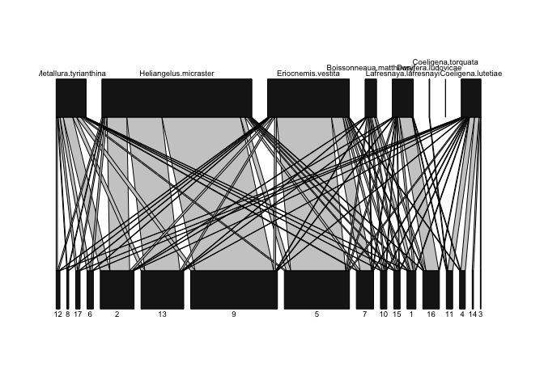

HumPlant R package
================
2025-02-14

- [Visualising community structure aming interacting hummingbirds and
  plants](#visualising-community-structure-aming-interacting-hummingbirds-and-plants)
  - [Installing the package](#installing-the-package)
  - [Taking a look at the data](#taking-a-look-at-the-data)
  - [Defining models for how morphologies influence the species’
    interactions](#defining-models-for-how-morphologies-influence-the-species-interactions)
  - [Simulate an interaction network based on the two morphological
    models](#simulate-an-interaction-network-based-on-the-two-morphological-models)
  - [Simulate an interaction network based on the species’
    abundances.](#simulate-an-interaction-network-based-on-the-species-abundances)
  - [Combining models based on abundances and
    morphologies](#combining-models-based-on-abundances-and-morphologies)
- [Statistical analyses](#statistical-analyses)
  - [Model selection with single predictor
    versions](#model-selection-with-single-predictor-versions)
  - [Model selection with varying predictor
    versions](#model-selection-with-varying-predictor-versions)
  - [Model fitting](#model-fitting)

## Visualising community structure aming interacting hummingbirds and plants

The following script will guide you through examples of how to model
mechanisms, such as morphological matching, and visualise their effects
on species interactions.

### Installing the package

You will use the functions from the ‘HumPlant’ R package, which is
hosted on this GitHub page. We use another package called ‘devtools’ to
install it, which we first have to install and load in your R session.
Remove the hashtag to enable the installation.

``` r
#install.packages('devtools') #you only need to run this once
require(devtools)
```

I will refine the content throughout the course with your feedback and
suggestions. Therefore, you must reinstall the package using the code
below after each update. Remove the hashtag to enable the installation.

``` r
#devtools::install_github("JesSonne/HumPlant")
```

Now load the package in your current R session.

``` r
library(HumPlant)
```

### Taking a look at the data

The object ‘Cajanuma’ contains the data I collected at the
high-elevation site in Southern Ecuador. It contains the interaction
network along with the ecological attributes we will use for the
modelling.

Below, we define a series of objects with the data we are going to use.
Notice that the birds and plants are sorted according to the length of
their bill/flower

``` r
#loading the interaction matrix
net=Cajanuma$Network;net=as.matrix(net)

#loading ecological attributes
hum_morph=Cajanuma$Hummingbird_morphologies
plant_morph=Cajanuma$Plant_morphologies

hum_abund=Cajanuma$Hummingbird_abundances
plant_abund=Cajanuma$Plant_abundances

plant_phenol=Cajanuma$Plant_phenologies

#number of hummingbirds and plants in the comunity
n_hums=ncol(net)
n_plants=nrow(net)
```

Use the ‘plotweb’ function to visualise the network. Notice that the
species are sorted according to the length of their bill/flowers from
the shortest bills/flowers on the left to the longest on the right.

``` r
plotweb(net,method="normal",empty = F)
```

<!-- -->

The following code converts or ‘tile’ the vectors on the ecological
attributes into a matrix format. This is just to make them easier to
work with.

``` r
hum_morph_mat=tile_vector(net,hum_morph)
plant_morph_mat=tile_vector(net,plant_morph,by_col = T)

hum_abund_mat=tile_vector(net,hum_abund)
plant_abund_mat=tile_vector(net,plant_abund,by_col = T)

hum_abund_mat=tile_vector(var=hum_abund)
plant_abund_mat=tile_vector(var=plant_abund,by_col = T)
```

### Defining models for how morphologies influence the species’ interactions

The code below defines two initial models for how the morphologies of
species might influence the species’ interactions. These are just two
examples to get you started. In the project, you should come up with
additional models that perhaps better capture the structure of the
community. I will help you write the code as long as you can
specifically formulate your hypotheses.

The first is based on the ‘forbidden links’ concept in which species are
prevented from visiting certain partners in the community. In this case,
hummingbirds are prevented from visiting flowers that are longer than
their bill + tounge length. The tounge length is defined as a fraction
of the total bill length.

The second model is derived from optimal foraging theory, where
hummingbirds should prefer visiting flowers that are morphologically
similar to their bills. Here, we simply subtract the two measurements
from each other and take the absolute value. 0 will reflect a perfect
match, and higher values reflect increasing mismatch. For convenience,
we take inverse, such that higher values represent greater morphological
matching.

``` r
barrier_long_flowers=function(h=hum_morph_mat,p=plant_morph_mat,tounge=1.8){
  m=h*tounge-p
  
  b=m;b[]=1
  b[which(m<0)]=0
  
  return(as.matrix(b))
}

absdif=function(h=hum_morph_mat,p=plant_morph_mat,tounge=1.8){
  m=1/(abs(h*tounge-p))
  return(as.matrix(m))
}
```

### Simulate an interaction network based on the two morphological models

Start by stating the number of interactions you simulated per
hummingbird species. To start with, let’s assume they have the same
total number of interactions.

``` r
n_hum_int=rep(100,n_hums) 
```

Now, generate matrices of morphological matching. Notice that the two
models use different tongue lengths. Why do you think that is, and does
it make sense?

``` r
matching_matrix=absdif(tounge=1)
barrier_matrix=barrier_long_flowers(tounge=1.8)
```

The function below simulates an artificial network based on your input.
The purpose is to directly visualise how different hypotheses/models
affect interactions in the network. The function takes several input
files, where some can be left empty (denoted ‘NULL’).

The simulation itself is a two-stage process.

- First, we simulate whether a pair of species have any or no
  Interactions. As such, this is the binary part of the simulation. In
  this example, we use the model of the morphological barrier.

- Secondly, we simulate how often a pair of species interact, should
  they have any interactions with each other. As such, this is the
  quantitative part of the simulation. In this example, we use the model
  of the morphological matching.

When the simulation concludes, it generates two indices of network
structure. One index measures the degree of network nestedness, while
the other measures the degree of specialisation. Use these two indices
to discuss the implications of your hypotheses for niche differentiation
in the community.

NB. In the code, we make no specific assumptions about how many
interactions the plants have, but we could. Be aware that when
specifying the number of interactions for both plants and hummingbirds,
they must sum up to the same number (i.e. the total number of
interactions in the network). If ‘p’ and ‘h’ are both NULL, you must
specify the total number of interactions in the network ‘n’.

``` r
sim_net_morph=simulate_ZI_matrix(
                           #A vector stating the total number of interactions for each plant species
                           p = NULL,                     
                           #A vector stating the total number of interactions for each hummingibird species
                           h = n_hum_int,                
                           #Alternatively state the total number of interactions in the network 
                           n = NULL,                     
                           #A matrix of probabilities for two individual species to have any interactions
                           W_bin=barrier_matrix,         
                           #A matrix of weights proportional the species interaction frequencies
                           W_freq=matching_matrix,       
                           ) 
```

    ##                   Nestedness Complementary specialization 
    ##                   20.0164723                    0.3150969

Now, let’s take a look at the simulated network. Does the structure
coincide with your expectations and what could be improved?

``` r
plotweb(sim_net_morph,method="normal",empty = F)
```

<!-- -->

### Simulate an interaction network based on the species’ abundances.

Common species are more easily encountered than rare species. If species
interact by random encounters, the interaction probability between two
species (i and j) equals their joint ecounter probability = P(i) x P
(j). We expect the encounter probabilities of species to be strongly
correlated with their abundances. Therefore, an intuitive null model
would assume the number of interactions between two species are
proportional to the product of their abundances. We will use it for the
quantitative part of the next simulation.

``` r
abundance_model=function(h=hum_abund_mat,p=plant_abund_mat){
  m=h*p
  return(m)
}

#compute the matrix
abundance_matrix=abundance_model()
```

Under the assumption of random interactions, there are no processes
preventing two species from having any interactions. Therefore, for the
binary part of the simulation, we use a matrix stating that all
interactions are equally likely.

``` r
unit=net;unit[]=1
```

Now, we are ready to simulate a network without the influence of species
morphologies where species interact as they randomly encounter each
other.

NB. In the code, we now make no specific assumptions about how many
interactions the plants and hummingbirds have. We only state the total
number of interactions we want simulated ‘n’.

``` r
sim_net_abund=simulate_ZI_matrix(
                           #A vector stating the total number of interactions for each plant species
                           p = NULL,                     
                           #A vector stating the total number of interactions for each hummingibird species
                           h = NULL,                
                           #Alternatively state the total number of interactions in the network 
                           n = 500,                     
                           #A matrix of probabilities for two individual species to have any interactions 
                           W_bin=unit,         
                           #A matrix of weights proportional the species interaction frequencies
                           W_freq=abundance_matrix,       
                           ) 
```

    ##                   Nestedness Complementary specialization 
    ##                     34.18082                      0.00000

Let’s plot it! Do you recognize this structure? For clarity, we orde the
species in the network according to their abundance. The rarest left,
and the most common species is on the right.

``` r
sim_net_abund=sim_net_abund[order(plant_abund),]
sim_net_abund=sim_net_abund[,order(hum_abund)]

plotweb(sim_net_abund,method="normal",empty = F)
```

<!-- -->

### Combining models based on abundances and morphologies

We can combine the models based on morphologies and abundances and
visualize how they combined influence the structure of the network.

We just need to tell the function how to aggregate the weight matrices.
For most applications, it makes the most sense to use the product

``` r
sim_net_morph_abund=simulate_ZI_matrix(
                           #A vector stating the total number of interactions for each plant species
                           p = NULL,                     
                           #A vector stating the total number of interactions for each hummingibird species
                           h = NULL,                
                           #Alternatively state the total number of interactions in the network 
                           n = 500,                     
                           #A matrix of probabilities for two individual species to have any interactions 
                           W_bin=barrier_matrix,         
                           #A matrix of weights proportional the species interaction frequencies
                           W_freq=list(abundance_matrix,matching_matrix),
                           #how to combine the weight matrices for the binary part of the simulation
                           comb_method_bin = "product",
                           #how to combine the weight matrices for the quantitative part of the simulation
                           comb_method_freq =  "product",
                           #should the matrices be normalised before they are combined - always use 'TRUE'
                           normalize = TRUE,
                           ) 
```

    ##                   Nestedness Complementary specialization 
    ##                   27.8408287                    0.4763723

``` r
plotweb(sim_net_morph_abund,method="normal",empty = F)
```

<!-- -->

## Statistical analyses

Below is a tutorial on the statistical analyses used in this project.
They are categorized as a zero-inflated negative binomial model. the
zero inflation implies that the interaction data is influenced by a mix
between a binary and a quantitative process. Below the outward-facing
functions (i.e. FitInteractionModel, and evaluatePredictorCombinations),
the underlying engine is the glmmTMB from glmmTMB R package
(<https://cran.r-project.org/web/packages/glmmTMB/glmmTMB.pdf>).

### Model selection with single predictor versions

The aim of this step is to identify the set of predictor variables that
best describe the species interactions. The function below repeats the
analyses for each combination of predictor sets. Each combination is
evaluated by the Akaike Information Criterion (AIC).

The Akaike Information Criterion (AIC) is a tool used to compare
different statistical models. It helps choose the ‘best’ model by
weighing how well each model fits the data against its
complexity—simpler models are favoured when they perform nearly as well
as more complicated ones. Essentially, a lower AIC value indicates a
model that better balances accuracy with simplicity. Models with a
difference in AIC \< 2 are considered equally well-fitting the data.

The function returns an overview of the predictor combinations alongside
the AIC values sorted from smallest at the top to highest at the bottom.
The delta AIC corresponds to the difference between a focal AIC and the
lowest AIC. Hence, the first row will always have delta AIC = 0.

``` r
#state here the names of the matrixes you want to be fitted for the quantitative and the binary part, respectively
freq_preds=mget(c("matching_matrix","abundance_matrix"))
zi_preds=mget(c("barrier_matrix"))

# --- Evaluate Predictor Combinations ---
results <- EvaluatePredictorCombinations(response = net,    #state the empirical interaction matrix
                                         countCandidates = freq_preds, #state the list of of predictors for the quantitative part
                                         ziCandidates = zi_preds)      #state the list of of predictors for the binary part

# Print the sorted results (lowest AIC on top) with delta AIC.
print(results)
```

    ##   count_matching_matrix count_abundance_matrix zi_barrier_matrix      AIC
    ## 1                     1                     NA                 1 398.7876
    ## 2                     1                     NA                NA 401.0851
    ## 3                    NA                     NA                 1 402.1907
    ## 4                    NA                     NA                NA 406.0623
    ##   delta_AIC
    ## 1  0.000000
    ## 2  2.297490
    ## 3  3.403074
    ## 4  7.274701

The results indicate that the model incorporating all three
predictors—morphological matching, morphological barrier, and
abundances—fits the data better than any other combination of
predictors.

### Model selection with varying predictor versions

The earlier analysis considered only a single version of each predictor
variable, which required us to assume specific trait values that could
influence the models (e.g., morphological matching and morphological
barriers such as species’ tongue lengths).

The function EvaluatePredictorCombinations addresses these constraints
by accepting a three-dimensional array instead of a matrix. This array
is structured with dimensions h, p, and i, where h represents the number
of hummingbirds (columns), p represents the number of plants (rows), and
i represents the number of variations.

In this example, we compute 20 variations that correspond to different
tongue lengths. For the morphological barrier model, tongue lengths vary
from 1.8 (a scenario where every plant is accessible to at least one
hummingbird) to 5 (where all hummingbirds can access every plant). In
contrast, we let the morphological matching model assume a broader range
of tongue lengths (0.5 to 5), acknowledging that hummingbirds may prefer
flowers that are shorter than their bills.

Be aware that this step may take minutes to run!

``` r
#Assumed variation in tongue lengths for the barrier model
tongue_values_barrier=seq(1.8,5,length.out=20)

#Compute the array predictor
barrier_array <- repeat_function(barrier_long_flowers, vary = list(tounge = tongue_values_barrier),
                                 h = hum_morph_mat, p = plant_morph_mat)

#Assumed tongue lengths for the matching model
tongue_values_matching=seq(0.5,5,length.out=20)
matching_array <- repeat_function(absdif, vary = list(tounge = tongue_values_matching),
                                 h = hum_morph_mat, p = plant_morph_mat)


#Combine arrays and matrices in a list format that the analysis can read.
#Notice that we maintain the abundance predictor in matrix format
pred1=mget(c("matching_array","abundance_matrix"))
pred2=mget(c("barrier_array"))


# --- Evaluate Predictor Combinations ---
results <- EvaluatePredictorCombinations(response = net,
                                         countCandidates = pred1,
                                         ziCandidates = pred2,
                                         maxminiter = 100000)

#prints the first 20 rows
print(head(results,20))
```

    ##    count_matching_array count_abundance_matrix zi_barrier_array      AIC
    ## 1                     3                      1                3 387.3586
    ## 2                     3                      1                4 387.9486
    ## 3                     3                      1                5 389.3541
    ## 4                    15                      1               18 393.1813
    ## 5                    15                      1               19 393.1813
    ## 6                    15                      1               20 393.1813
    ## 7                    10                      1               18 394.2873
    ## 8                    10                      1               19 394.2873
    ## 9                    10                      1               20 394.2873
    ## 10                   10                      1               11 394.5965
    ## 11                   11                      1                2 394.6844
    ## 12                    9                      1               18 395.3293
    ## 13                    9                      1               19 395.3293
    ## 14                    9                      1               20 395.3293
    ## 15                   10                      1               NA 395.4320
    ## 16                   10                      1                5 395.8946
    ## 17                   10                      1                6 395.9048
    ## 18                   10                      1                7 395.9383
    ## 19                   10                      1                8 395.9383
    ## 20                   10                      1                9 395.9383
    ##    delta_AIC
    ## 1  0.0000000
    ## 2  0.5900109
    ## 3  1.9955057
    ## 4  5.8226582
    ## 5  5.8226582
    ## 6  5.8226582
    ## 7  6.9286515
    ## 8  6.9286515
    ## 9  6.9286515
    ## 10 7.2378918
    ## 11 7.3258199
    ## 12 7.9707004
    ## 13 7.9707004
    ## 14 7.9707004
    ## 15 8.0733905
    ## 16 8.5359862
    ## 17 8.5461825
    ## 18 8.5796673
    ## 19 8.5796673
    ## 20 8.5796673

``` r
#Now we can plot the different tounge length against the model information criteria (AIC)
```

Let’s plot the results and determine the optimal tongue length for each
model, if one exists. Since the previous function generates multiple
combinations of predictor variables for each tongue length, we aggregate
the results to extract a single AIC value per tongue length level—the
minimum value, which corresponds to the best-fitting model for that
variation.

``` r
par(mfrow=c(1,2))
#first for the morphological barrier
select="zi_barrier_array"
df=data.frame(delta_AIC=results$delta_AIC,
              tongue_values=tongue_values_barrier[results[[select]]])

sub=aggregate_by_category(df = df,cat_col = "tongue_values",cont_col = "delta_AIC",func = min)

plot(delta_AIC~tongue_values,data=sub,type="lines",main=select)
```

    ## Warning in plot.xy(xy, type, ...): plot type 'lines' will be truncated to first
    ## character

``` r
abline(h=2,lty=2)

#secondly for morphological matching
select="count_matching_array"
df=data.frame(delta_AIC=results$delta_AIC,
              tongue_values=tongue_values_matching[results[[select]]])

sub=aggregate_by_category(df = df,cat_col = "tongue_values",cont_col = "delta_AIC",func = min)

plot(delta_AIC~tongue_values,data=sub,type="lines",main=select)
```

    ## Warning in plot.xy(xy, type, ...): plot type 'lines' will be truncated to first
    ## character

``` r
abline(h=2,lty=2)
```

<!-- -->

### Model fitting

Below is a function that fits a gzero-inflated negative binomial model,
using a specified set of predictor variables. In this example, we
include only those predictors that were identified in the best-fitting
model(s) shortlisted by the preceding function.

``` r
results=fitinteractionModel(net,countPredictors = list(matching_matrix),ziPredictors = list(barrier_matrix))
print(results$model)
```

    ## Formula:          count ~ countPred1 + (1 | plant) + (1 | hummingbird)
    ## Zero inflation:         ~ziPred1
    ## Data: df
    ##       AIC       BIC    logLik  df.resid 
    ##  398.7876  419.1762 -192.3938       129 
    ## Random-effects (co)variances:
    ## 
    ## Conditional model:
    ##  Groups      Name        Std.Dev. 
    ##  plant       (Intercept) 8.185e-06
    ##  hummingbird (Intercept) 7.591e-01
    ## 
    ## Number of obs: 136 / Conditional model: plant, 17; hummingbird, 8
    ## 
    ## Dispersion parameter for nbinom1 family (): 10.6 
    ## 
    ## Fixed Effects:
    ## 
    ## Conditional model:
    ## (Intercept)   countPred1  
    ##      0.4450       0.3106  
    ## 
    ## Zero-inflation model:
    ## (Intercept)      ziPred1  
    ##      0.2884     -19.4154
